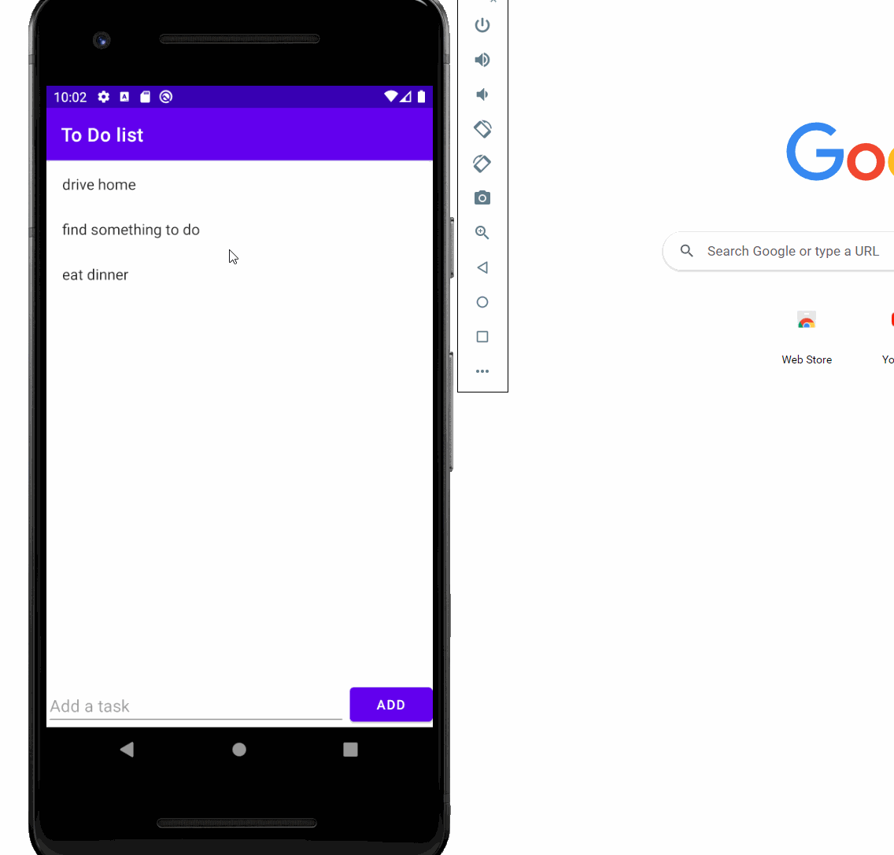

### ToDoList_Meta
Training lab 1
Core Features
* [x] Add a task item to the to do list
* [x] Remove a task item from the to do list
* [x] Implement a RecyclerView to display all task items
### Stretch Features
* [x] Edit the text of an item that has been added to the list
* [x] Tap a to do item to bring up an edit screen for that item.

